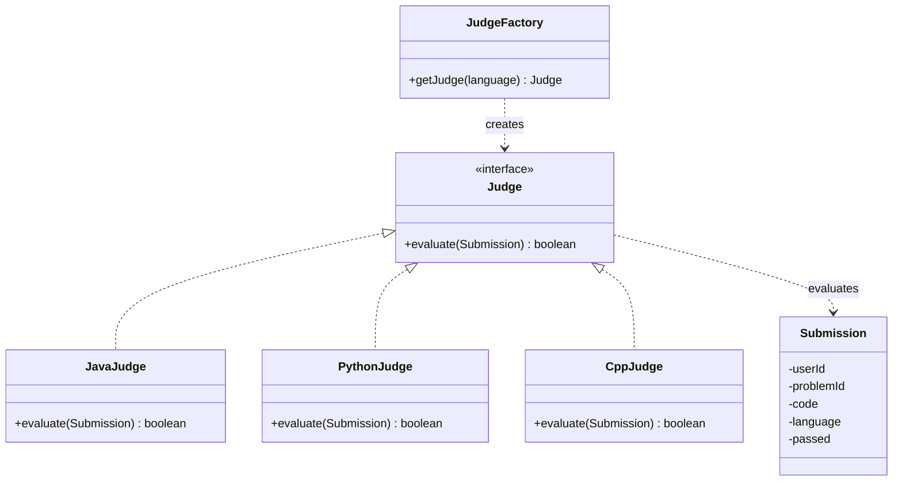

# Design LeetCode — Low-Level Design

**Problem statement**: model the core submission-judging system of a competitive
coding platform — a submission in some language comes in, gets judged, and
comes out pass/fail.

This is an LLD exercise, not a running service: there's no server, no live
demo. What's here is the class structure itself — `entity` / `judge` /
`factory` packages, kept genuinely separate so the design reads the same way
it's organized on disk.

## Class diagram



## Design rationale

- **Strategy (`Judge`)** — each language's judging logic (compile/run/diff) is
  wildly different internally but has the same shape from the outside:
  `evaluate(Submission) -> boolean`. Adding a new language means adding one new
  class; nothing that already works has to change.
- **Factory (`JudgeFactory`)** — the "which Judge for which language" decision
  is centralized in one place instead of being an `if/else` scattered across
  every caller. Callers only ever depend on the `Judge` interface.
- **Binary pass/fail** — deliberately the smallest thing that could work for
  this scope. A real platform usually has more states (compile error, time
  limit exceeded, wrong answer, runtime error); binary was a conscious scoping
  decision, not an oversight.

## What I'd extend

- **Verdict as an enum, not a boolean** — `PASSED / WRONG_ANSWER / TLE / COMPILE_ERROR / RUNTIME_ERROR`
  instead of `boolean passed`, once "why did it fail" matters.
- **State pattern for a `Submission`'s lifecycle** — `QUEUED -> RUNNING -> JUDGED`
  is a real state machine. I considered modeling it with State instead of the
  current plain boolean flag, and deliberately didn't: at this scope there's
  no behavior that actually differs per state (no per-state methods, no
  transitions to guard), so State would just be ceremony around a field. It's
  the right call once submissions get requeued, retried, or judged
  asynchronously across multiple workers.
- **Sandboxed execution** — the three `Judge` implementations mock the
  compile/run step; a real version would shell out to an actual sandboxed
  compiler/interpreter per language, with resource and time limits.

## Run it

```bash
cd design-leetcode
mvn test                 # runs JudgeFactoryTest
mvn exec:java             # runs Main, prints a few judged submissions
```
